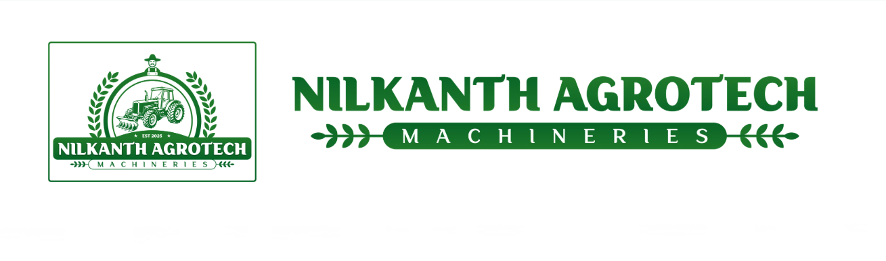

# Nilkanth Agrotech Machineries (NTM) - Corporate Website



Welcome to the official repository for the **Nilkanth Agrotech Machineries** corporate website. This project is a fully responsive, modern web application built to showcase NTM's extensive portfolio of agricultural machinery, services, and commitment to the farming community.

## 🌟 Overview

Nilkanth Agrotech Machineries (NTM) is dedicated to driving transformation in the agricultural sector by providing advanced, reliable, and efficient equipment. This website serves as the digital storefront, offering comprehensive information about products like Power Weeders, Grass Cutters, and more, while seamlessly connecting customers with sales and support teams.

## ✨ Features

- **Modern UI/UX:** A clean, professional, and visually appealing design tailored to the agricultural industry using custom CSS (Grid & Flexbox).
- **Fully Responsive:** Optimized for all devices, from desktop monitors to mobile phones, ensuring a seamless user experience.
- **Dynamic Product Gallery:** Interactive galleries with hover zoom animations to showcase products and customer experiences in high detail.
- **Dynamic Routing & Modals:** Intuitive navigation with working dropdown menus and interactive modals (e.g., dynamic product detail views).
- **Performance Optimized:** Built with vanilla HTML, CSS, and JavaScript for lightning-fast load times without heavy framework overhead.
- **Integrated Contact & Location:** Fully functional contact forms and integrated Google Maps for easy customer outreach.

## 📂 Project Structure

```text
nilkanth-agrotech/
├── index.html               # Main Homepage
├── about.html               # About Us Page
├── mission-vision.html      # Mission & Vision Page
├── service.html             # Services Overview Page
├── product.html             # Product Listing Page
├── product-details.html     # Dynamic Product Details Page
├── product-gallary.html     # Product Image Gallery
├── customer-gallary.html    # Customer Experience Gallery
├── contact.html             # Contact Us & Location Page
├── style.css                # Global Stylesheet (Custom CSS System)
├── script.js                # Core Interactive Logic (Vanilla JS)
└── images/                  # Static assets and graphics
```

## 🛠️ Technologies Used

- **HTML5:** Semantic markup for structured, SEO-friendly content.
- **CSS3:** Advanced styling using CSS Variables, Flexbox, and CSS Grid for layout management.
- **Vanilla JavaScript (ES6):** Used for DOM manipulation, dynamic content rendering, URL parameter parsing, and interactive UI components (modals, mobile menus).
- **FontAwesome:** Scalable vector icons for intuitive user navigation.
- **Google Fonts:** Modern typography utilizing the *Poppins* font family.

## 🚀 Getting Started

This project uses static web technologies and requires no complex build steps or dependencies.

### Running Locally

1. **Clone the repository:**
   ```bash
   git clone https://github.com/your-username/nilkanth-agrotech.git
   ```
2. **Navigate to the directory:**
   ```bash
   cd nilkanth-agrotech
   ```
3. **Open the project:**
   Simply double-click on `index.html` to open it in your default web browser, or use a local development server (like VS Code's Live Server extension) for live-reloading during development.

## 🤝 Contribution Guidelines

If you are a developer looking to update the site:
1. Ensure all new CSS classes follow the existing naming conventions found in `style.css`.
2. Optimize all images added to the `images/` directory to maintain fast page load speeds.
3. Test all layout changes across Desktop, Tablet (992px), and Mobile (576px) breakpoints.

## 📧 Contact

**Nilkanth Agrotech Machineries**
- **Location:** 1657, New Rajasthan Hotel, Near Moti Khodiyar Mandir Nehere, Piplag Village Road, Piplag, Nadiad, Kheda
- **Hotline:** +91 9825924472 / +91 7817012888
- **Email:** nilkanthagrotech05@gmail.com / pjayant715@gmail.com

---
*Empowering farmers with precision equipment and reliable machinery for a sustainable agricultural future.*
